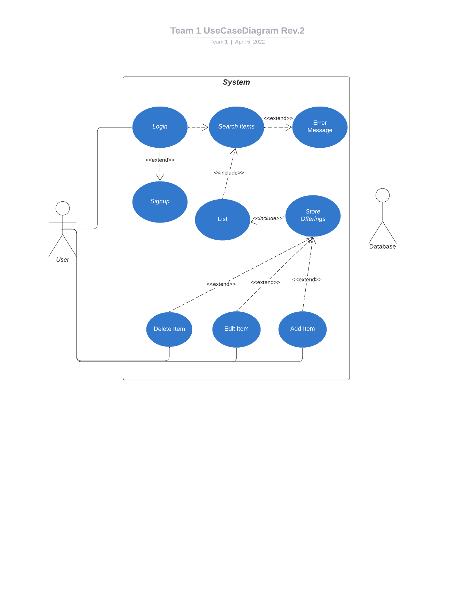

# Use Case Model

**Author**: Team 1

## 1 Use Case Diagram

## 2 Use Case Descriptions

 - Users should be prompted to login to the app. As soon as the app opens, the user should be given a screen where they can fill out their username and password, as well as have a signup button. The precondition is that there is a user actor to manipulate the app. The postcondition is that the user should log in to the app.
 - A user should be able to signup for the app. If a user does not have an account on record, they must be able to sign up in order to create an account. Within this signup screen, a user will fill out fields so that they can supply their desired username, email, and password. After completing these fields and submitting their responses, they should have an account. The precondition is that a user presses the "signup" button on the login screen. The postcondition is that a user will then have an account within our database.
 - Logged in users should be able to provide search terms and be provided a list of products. This can be done with the user inputting text in to a search box within the app, sending the request, and receiving back their results. The precondition is that a user actor must have already logged in so that they can populate the search bar region. Postconditions include a list of products that are most relevant to the user's search results.
 - An error message should be thrown if the user's search results are not within the store's list. If a user inputs a search and thre are no relevant results, there should be an error message that becomes apparent to the user. Preconditions include a search made by the user that have exactly 0 relevant items. Postconditions include an error message that the user can see.
 - An employee should be able to add an item to the store offerings. This means that if an employee uses the app, they should be able to create an object to put within the store's offerings. The precondition is that a user actor with the "isEmployee" variable set to "True" must be existing in order for them to create an item. The postcondition is that an item should be added to the store's offerings.
 - An employee should be able to delete an item to the store offerings. This means that if an employee uses the app, they should be able to remove an object that is within the store's offerings. The precondition is that a user actor with the "isEmployee" variable set to "True" must be existing in order for them to create an item. The postcondition is that an item should be deleted to the store's offerings.
 - An employee should be able to add an edit an item within the store offerings. This means that if an employee uses the app, they should be able to edit an existing object from the store's offerings. The precondition is that a user actor with the "isEmployee" variable set to "True" must be existing in order for them to create an item. The postcondition is that an item should be edited from the store's offerings.
 - The database should supply the store with products. Precondition should be a database actor that exists. Postcondition is a store with products to sell.
 - The store should provide a list of sellable items to display to the customer. The store will have items that it has ready to sell. The store should then display what it has available through a list. Precondition should be a nonzero store offering. Postcondition should be a list of available products for the specific store.