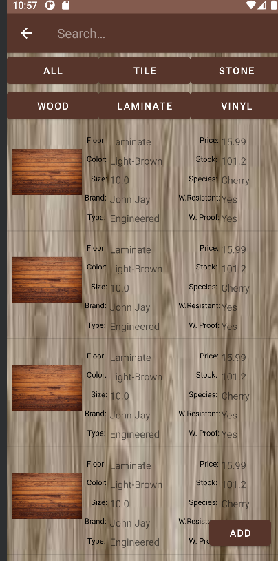

<h1 style="color:purple;font-size:36px;text-decoration:underline">TEAM 1: Flooring Icon Management(FIM) Application<h1>

## User Manual -- Final Release(v.2.0.0)

## Contents

- [User Manual -- Final Release(v.2.0.0)](#user-manual----final-releasev200)
- [Contents](#contents)
- [Description](#description)
- [Technical Specifications](#technical-specifications)
- [Steps to Start Using FlooringIconManager](#steps-to-start-using-flooringiconmanager)
- [Important Features of FlooringIconManager](#important-features-of-flooringiconmanager)
- [FAQ](#faq)
- [Team Members](#team-members)

## Description

 Team One was hired and tasked by Flooring Incorporated to create a portable, dynamic robust Android application that is meant to alleviate supply chain and inventory issues. Flooring Incoporated disclosed that the company was having issues ensuring that suppliers and management had an up-to-date working inventory. This has resulted in a less than ideal situation when dealing with supplier and client relationships. This additionally has resulted in profit losses pertaining specifically to the warehouse's inventory. This has caused conflicts between Flooring Incorporated and the stores it supplies, and in turn has caused a trickling down impact between the local stores and it's everyday consumers.

As such, Team One is currently developing the Android application called <b>Flooring Icon Management</b> or <b>FIM</b>, which seeks to alleviate the supply chain issues that Flooring Icon Incorporated is dealing with. <b>FIM</b> will be a robust, dynamic inventory system that will serve several purposes: (1) It will provide management with an up-to-date inventory list of all the stores that it serves _still in production_ (2) It will provide management with the capability to update and edit the specific store's inventories in real time _still in production_ (3) It will provide a reliable, intuitive easy user interface that management can quickly learn to allow for a smooth transition from its previous system (4) <b>FIM</b> will have the capability to serve management as well as provide everyday consumers the capability to quickly search inventory at a specific store (5) Continuing from point four(4) <b>FIM</b> will be secure system, with two seperate types of users(employee and consumer) that will have different capabilities.

The <b>FIM</b> Android Application system is meant to be used on any type of mobile device that supports the Android operating system, to ensure that real-on-time capabilties and assurances are met. <b>FIM</b> was created with management and consumers alike, and more importantly, their time and money! This simple guide will help you get started using <b>FIM</b>, and make sure you use the application as intended.

## Technical Specifications

- <b>Platform</b>: Android Software Development Kit _(SDK)_

- <b>Back-End|Database</b>: Back4App (based on the Parse Platform) 

  - \*\*For more Information Pertaining to the Storage and Back-End Capability for the System [see here](https://www.youtube.com/watch?list=PL_lJrbgUtzded_bF8KVl_puWZ-zDCLw7R&time_continue=3&v=vLfIDscFgQI&feature=emb_logo)

- <b>Operating System</b>: Android SDK 21 (minimum) 

  - \*\*Note that this is the minimum SDK package necessary to run the application, a later released SDK will still function as intended with <b>FIM</b>

- <b>Environment</b>: Any Android mobile compatible device

<h2>Installation</h2>

On your Android mobile device, please utilize your preferred Android download application manager. Some popular _thrid-party Android store applications_ are: _Amazon Appstore_, _APKMirror_, _APKPure_, and _QooApp_. Any of the specified downloaders above will be able to find, and load Flooring Icon Manager/<b>FIM</b> onto your Android-Compatible device. In the search bar, please type in 'Flooring Icon Manager' or 'FIM' and click on the respective download link. After downloading the application to your mobile Android-compatible device, you'll be able to access all of its powerful features and utilize the system depending on your permission level \*\*(<b>User, Employeee</b>).

Once you have successfully downloaded <b>FIM</b> you'll be able to access it by pressing on the _FIM_ icon on your Android's device's home page. Please see pictures in "Steps to Start Using FloorIcon Manager" as well as below overall UI that depicts how GLM wil be reflected on your respective device <b>\*\*_(Note:User(s) screen will vary depending on device)_</b>
  
  

Upon opening the application, you'll be brought to the main application page, where you will be prompted to sign in or register! Depending on the permission level, you will be granted different capabilities as requested by <b>Flooring Incorporated</b>.

Consumers or regular day user(s) of the system can readily access a list of stores and get a real-time update pertaining to that specific store's inventory. No longer will you be heading to the store, just to find out that the material you required was not there. No more wasted time! For Employees and Management, will also be given the same real-time updated inventory listing, but will also have the capability to add, edit the inventory listing as needed!

## Steps to Start Using FlooringIconManager

  <ul style="color:purple;font-size:24px;text-align: center;list-style-position:inside;list-style-type:none;">
    <li style="text-decoration:underline;font-weight:bold"><b>Step 1: Authentication</b> </li>
    <li style="text-decoration:underline;font-weight:bold"><b>Step 2: Viewing Floor Inventory</b> </li>
    <li style="text-decoration:underline;font-weight:bold"><b>Step 3: Adding Inventory<b> </li>
    <li style="text-decoration:underline;font-weight:bold"><b>Step 4: Searching Floor Inventory</b> </li>
    <li style="text-decoration:underline;font-weight:bold"><b>Step 5: Viewing Store Inventory(Still In Progress)</b> </li>
  </ul>

## Important Features of FlooringIconManager

- <h4 style="color:purple;font-weight:bolder"> Searching Our Inventory </h4>
- <h4 style="color:purple;font-weight:bolder"> Database Capability </h4>
- <h4 style="color:purple;font-weight:bolder"> Secure User Authentication System </h4>
- <h4 style="color:purple;font-weight:bolder"> List of All Stores (In Process) </h4>
- <h4 style="color:purple;font-weight:bolder"> Store - Real Time Inventory (In Process) </h4>

## FAQ

<h4 style="color:purple;font-weight:bolder">Question1: What happens if I can't find an item in your database inventory?</h4>

<b>Q1:</b>FIM was designed to allow for inventory to be added as needed. We understand that life is full of surprises, and as such, we have given FIM the robust ability to edit, and add new invntory as needed. Our vendor's employees will be able to add, edit inventory as needed! Where our everyday users will be restricted from taking such action. Life happens fast, don't fret, we are just as fast!

<h4 style="color:purple;font-weight:bolder">Question2: What is the difference between a User and Employee?</h4>

<b>Q2:</b> The FIM was designed for two seperate different workflows. Everyday user(s) will be able to utilize the system upon registering! If you happen to be management, our team will ensure that you are registered with the necessary permissions. This will permit all Employees with the extra capabilties that were discussed above! Rest assurred that our users, as well as our vendor's employees are given the proper access.

<h4 style="color:purple;font-weight:bolder">Question3: Is the FIM application fully functional?</h4>

<b>Q3:</b> Unfortunately, not at this time. Due to time constraints and unforseen budgetary restrictions certain aspects of FlooringIconManager are still being implemented. The majority of the application is fully functional! FlooringIconManager users will be notified once the application is fully functional, your patience and continued support means the world to us!

<h4 style="color:purple;font-weight:bolder">Question4: Does your application cost money to use? Is it a monthly service?</h4>

<b>Q4:</b> At this time, FlooringIconManager is completely free to the user!

<h4 style="color:purple;font-weight:bolder">Question5: Who can I contact if I run into technical difficulties?</h4>

<b>Q5:</b> Please refer all comments, constructive criticisms, and future inquiries to the section below! 

## Team Members

Get to know our Team!
| Full Name | Email Contact | Main Job Role |
|:-----------------------|:--------------------------|:------------------------------------------|
| Michael Boodoosingh | MichaelB@teamOne.com | Quality Assurance |
| Jashandeep Singh | JashanD@teamOne.com | Software Architect, UX,UI Designer |
| Iman Toussi | ImanT@teamOne.com | Software Developer |
| Joceline Garcia | JocelineG@teamOne.com | Project Manager, UX,UI Designer |
| Jonathan Yulan | JonathanY@teamOne.com | Software Developer |
